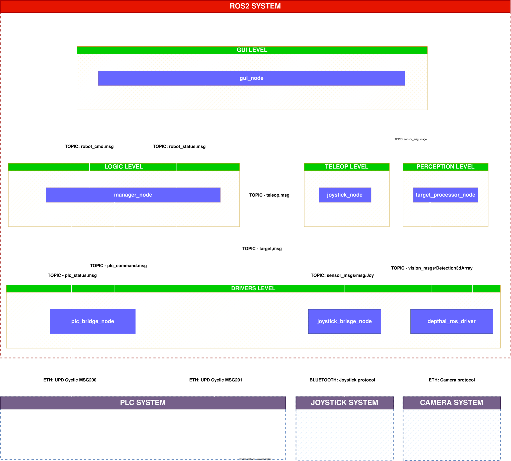
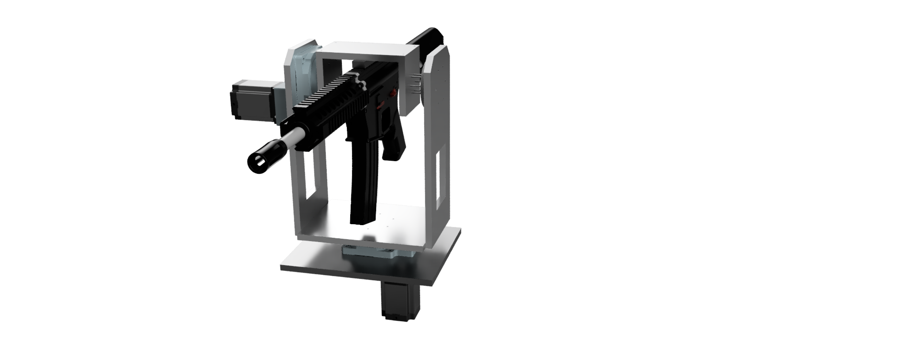

# Argus Gate: ROS 2 Airsoft Sentry Turret

**Argus Gate** is a custom robotic project for an autonomous **Airsoft Sentry Turret** (Pitch & Yaw). The system uses **ROS 2 Humble** (running on Ubuntu 22.04) for high-level logic and vision, while a **Siemens S7-1214C PLC** handles the physical motion with **Point-to-Point (PTP) interpolation** for precise axis control.

---

## 🧩 System Overview

The **Argus Gate** system is structured as a **modular ROS 2 graph** with five functional levels, ensuring safety, modularity, and efficient communication. Each level handles specific responsibilities, from hardware interaction to high-level decision-making.



### Architecture Diagram
```
[GUI Level] (Planned)
    ↓ Subscribes: PlcStatus, Camera Stream
    ↑ Publishes: Mode Requests, Overrides

[Logic Level]
    ↓ Subscribes: TeleopCommand, Perception Data
    ↑ Publishes: PlcCommand
    • Mode Arbitration (IDLE, MANUAL_JOG, MANUAL_TRACK, AUTO_TRACK)
    • Safety Watchdog (Heartbeat Monitoring)

[Teleop Level]
    ↓ Subscribes: sensor_msgs/Joy
    ↑ Publishes: TeleopCommand
    • Maps joystick inputs to turret commands

[Perception Level] (Planned)
    ↓ Subscribes: DepthAI 3D Detections
    ↑ Publishes: Target Setpoints
    • TF2 Coordinate Transformation

[Drivers Level]
    ↓ Hardware I/O
    ↑ Publishes: PlcStatus, sensor_msgs/Joy, DepthAI Data
    • PLC UDP Bridge (100Hz)
    • Joystick Driver (SFML)
    • DepthAI Camera Driver
```

### Levels Description

1. **GUI Level** (Planned): Web-based dashboard for monitoring and control.
2. **Logic Level**: Central brain managing modes and safety.
3. **Teleop Level**: User input processing from joysticks.
4. **Perception Level** (Planned): Vision processing for autonomous targeting.
5. **Drivers Level**: Low-level hardware interfaces.

---

## 📦 ROS 2 Packages

The project is organized into the following ROS 2 packages:

- **`argus_bringup`**: Launch files and configuration for starting the entire system.
- **`argus_description`**: URDF models and STL meshes for robot description and simulation.
- **`argus_drivers`**: Hardware drivers and interfaces (includes `plc_bridge_node`, `joystick_driver_node`).
- **`argus_interfaces`**: Custom message definitions and interfaces (includes `TeleopCommand`, `PlcCommand`, `PlcStatus`).
- **`argus_logic`**: Core logic and state management (`manager_node`).
- **`argus_teleop`**: Teleoperation utilities (`teleop_joy_node`).

---

## 🔄 How the System Works

The **Argus Gate** turret integrates **ROS 2** for high-level decision-making and **Siemens PLC** for motor control.

### Overall Functionality
- **ROS 2 Side**: Handles user inputs, mode arbitration and communication with the PLC with UDP bridge. It also calculates target positions to reach using **TF2 transforms** for coordinate transformations.
- **PLC Side**: It parses incoming commands, controls stepper motors in open-loop via pulse outputs, and sends back status (positions, errors).

### Motion Control and PTP Interpolation
Motor control is managed through **PLCopen Motion Control (MC) function blocks**:
- **PTP (Point-to-Point) Interpolation**: For positioning moves, the PLC uses PTP interpolation. This moves the axes directly to target positions without intermediate path planning, ensuring fast and accurate point-to-point motion. Coordinated multi-axis moves (pitch + yaw) are handled by the `LAxesGrpCtrl` function block, which applies kinematics for smooth interpolation and synchronization between axes.

---

## ⚙️ Hardware Details

*   **ROS2 PC:** Raspberry Pi 4 running Ubuntu 22.04.
*   **PLC:** Siemens S7-1214C PLC.
*   **Motors:** 2x **Nema 23 Stepper Motors** (Pitch & Yaw).
*   **Drivers:** 2x **DM542** digital stepper drivers.
*   **Control Method:** The PLC manages the motors in **Open Loop** using high-speed pulse outputs (PTO).
*   **Vision:** Luxonis OAK-D S2 Depth Camera.

---

## 📐 Mechanical Design & CAD

*   **Preview CAD Model:** Available as [turret.stl](./hardware/cad/turret.stl) in the **`/hardware/cad`** folder.
*   **ROS Meshes:** STL files for simulation (base_link, pitch_link, yaw_link) in **`argus_description/meshes`**.
*   **Range of Motion:** +-120° Yaw rotation / +-45° Pitch.



---

## 🚀 System Capabilities

- [x] **ROS 2 Workspace**: Standardized modular package structure.
- [x] **PLC Bridge**: Reliable 100Hz UDP communication with PLC.
- [x] **Manual Teleoperation**: Full control with Joystick interface.
- [ ] **Rviz Digital Twin**: Real-time 3D simulation and visualization.
- [ ] **TF2 Integration**: Dynamic coordinate transformation for targeting.
- [ ] **Flet Dashboard**: Web GUI for telemetry and remote control.
- [ ] **Autonomous Tracking**: Full-Auto mode using AI vision.

---

## 🛠️ Getting Started

### Prerequisites
- Ubuntu 22.04
- ROS 2 Humble (installation instructions: [ROS 2 Humble Installation](https://docs.ros.org/en/humble/Installation.html))
- Colcon build tools
- Python 3 and pip

### Installation
1. Clone the repository:
   ```bash
   git clone https://github.com/Luca-G49/argus_gate.git
   cd argus_gate_ws
   ```

2. Install dependencies:
   ```bash
   rosdep install --from-paths src --ignore-src -r -y
   ```

### Building the Workspace
```bash
colcon build --symlink-install
```

### Running the System
1. Source the workspace:
   ```bash
   source install/setup.bash
   ```

2. Launch the system (example launch file):
   ```bash
   ros2 launch argus_bringup gate_launch.py
   ```

For specific launch files, refer to the `argus_bringup` package.

## 🔗 Third-party Libraries and Dependencies

This project relies on the following open-source libraries and frameworks. We acknowledge and comply with their respective licenses:

- **ROS 2 Humble**: Apache 2.0 License - [ROS 2 Documentation](https://docs.ros.org/en/humble/)
- **SFML (Simple and Fast Multimedia Library)**: zlib License - [SFML Website](https://www.sfml-dev.org/)
- **DepthAI (Luxonis)**: Apache 2.0 License - [DepthAI GitHub](https://github.com/luxonis/depthai)
- **Flet**: Apache 2.0 License (for planned GUI) - [Flet GitHub](https://github.com/flet-dev/flet)

For full license texts, refer to the respective repositories or the `LICENSE` files in their distributions.

---

## 📄 License

This project is licensed under the MIT License - see the [LICENSE](LICENSE) file for details.

